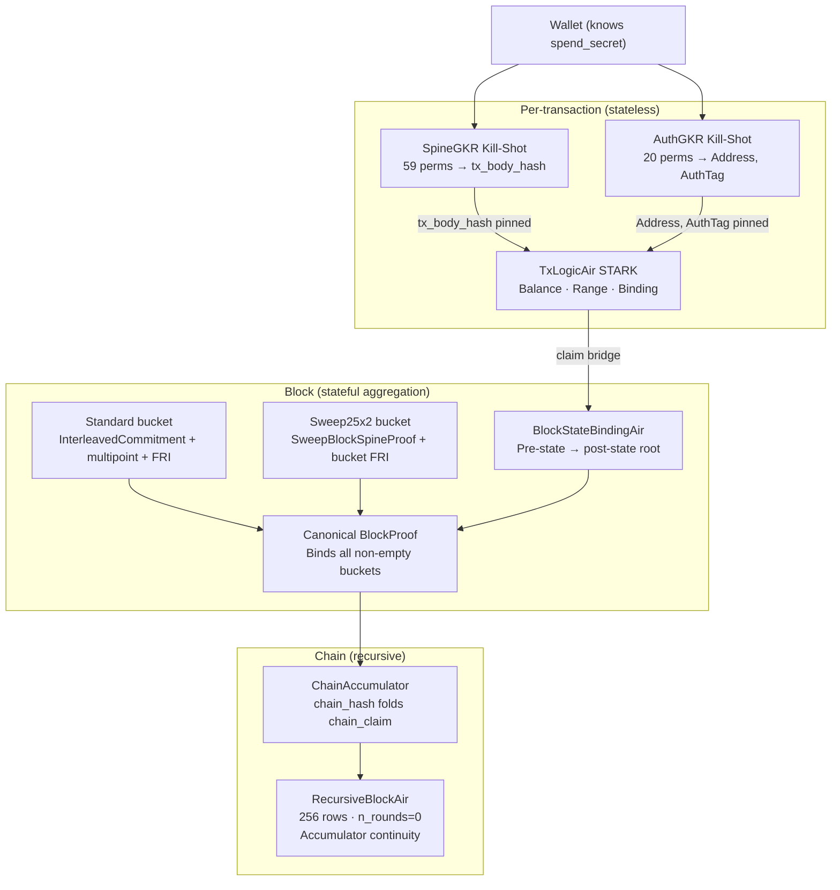

# Paranoid Zero: Proof Engine Security Analysis


## Abstract

The Paranoid Zero proof engine is built entirely over the binary tower field GF(2¹²⁸). Three properties of this field are load-bearing:

1. **Frobenius endomorphism:** squaring `x ↦ x²` is GF(2)-linear, i.e., free. This reduces `x⁷ = x · x² · x⁴` to 3 multiplications instead of 6, allowing the Poseidon2b S-box to be proved directly at degree 7 without decomposition.
2. **Poseidon2b is native:** designed for GF(2¹²⁸) with S-box `x⁷`, MDS matrix operations over the tower, and capacity IV domain separation — no field extension, no mismatch between hash and proof arithmetic.
3. **FRI-Binius PCS:** Reed-Solomon codes over the binary tower. All AIR constraints, all GKR sumchecks, and all FRI operations operate in the same field — no extension towers, no field-switching, no conversion artefacts that could create soundness gaps.

These three properties together enable **FROST-GKR** (Frobenius Reduction Over Shifted Tables): a unified degree-9 sumcheck over Poseidon2b permutation traces. SpineGKR covers 59 permutation slots, AuthGKR covers 20 slots, and SweepAuthGKR covers 125 slots; each sub-proof stays in GF(2¹²⁸) and is sound by the Schwartz-Zippel / Fiat-Shamir argument in §5.3.

The engine operates at three verification levels:

- **Transaction** — stateless ZK proof of ownership and balance; wallet-produced, valid until epoch anchor expires
- **Block** — standard and sweep transactions are aggregated in shape-specific buckets; the canonical `BlockProof` binds all bucket proofs plus `BlockStateBindingAir`, which proves the state-root transition
- **Chain** — 256-row recursive STARK accumulating the full chain into 6.5 KB, verifiable in ~5 ms

**System soundness: approximately 119–120 bits**, bottlenecked by the FROST-GKR relation checks (`ε_GKR ≤ 348/2¹²⁸` per sub-proof). `BlockStateBindingAir` contributes `44/2¹²⁸ ≈ 2⁻¹²³`. Privacy reduces to 128-bit Poseidon2b preimage resistance.

---

## 1. Security Claims

This document proves the following claims against a PPT adversary:

| ID | Claim | Proved in | Bound |
|----|-------|-----------|-------|
| SC-1 | A forged transaction proof cannot pass verification | §5, §6 | 2⁻¹²⁰ |
| SC-2 | N transaction proofs aggregated into a block cannot be selectively forged | §7 | 2⁻¹²⁸ |
| SC-3 | A block proof with inconsistent state transitions cannot pass | §8 | 2⁻¹²³ |
| SC-4 | A recursive proof with falsified state_root or chain_hash cannot pass | §9 | 2⁻¹²³ |
| SC-5 | spend_secret cannot be extracted from any proof or wire artifact | §10 | 2⁻¹²⁸ |
| SC-6 | The FROST-GKR degree-9 sumcheck is sound under the stated Schwartz-Zippel / Fiat-Shamir assumptions | §5.3 | 2⁻¹²⁰ |

---

## 2. Load-Bearing Design Decisions

The following construction choices affect soundness or privacy. Each has a formal security argument in the indicated section.

| Property | Security argument | §|
|----------|-------------------|--|
| `RecursiveBlockAir`: `n_rounds = 0`, `folded_symbols` all-`None`, query loop vacuous | The committed polynomial has exactly 2⁸ = 256 entries — a multilinear polynomial is uniquely determined by its Boolean-hypercube evaluation table. FRI proximity testing is redundant; the tensor check is an exact evaluation. | **9.2** |
| FROST-GKR unified sumcheck: round polynomial degree 9 | Schwartz-Zippel applies to the committed round polynomial degree. Fiat-Shamir soundness follows from the absorb-then-squeeze ordering of every round. | **5.3** |
| Per-bucket `InterleavedCommitment` caps cover all traces of each transaction shape | Standard and `Sweep25x2` transactions have different AIR shapes, so each non-empty bucket has its own joint commitment. Selective forgery inside a bucket requires forging that bucket's committed columns; the canonical `BlockProof` binds all buckets together. | **7.1** |
| Per-bucket FRI opening with deferred aggregation | A bucket-level multipoint sumcheck reduces that bucket's terminal claims to one evaluation point before the FRI opening. Soundness does not degrade with the number of transactions in the bucket. | **7.2** |
| Transaction AIRs contain no state-root checks | `TxLogicAir` and `SweepTxLogicAir` are intentionally stateless — they prove ownership and balance without knowledge of the chain state. Verifier-side canonical `PublicInputs` reconstruction plus `BlockStateBindingAir` binds the layers. | **7.3**, **8.1** |
| `BlockStateBindingAir` virtual selectors | Row/prefix selectors are verifier-known zero-padded MLEs of deterministic public selector tables. They are not witness columns and add no witness-dependent degree of freedom. | **8.3** |
| `spend_secret` absent from the Fiat-Shamir transcript | `absorb_public_boundary` accepts `&AuthPublicInputs`, a type that structurally cannot hold the secret. The verifier function `verify_auth_killshot` takes the same type. Exclusion is enforced by the Rust type system. | **10.1** |

---

## 3. Cryptographic Assumptions

**A1 (Poseidon2b collision):** No PPT adversary finds distinct inputs with the same Poseidon2b output; security λ = 128 bits. Poseidon2b over GF(2¹²⁸), width 4, 8 full rounds per the [Poseidon2 security analysis](https://eprint.iacr.org/2023/323.pdf).

**A2 (Poseidon2b preimage):** No PPT adversary inverts Poseidon2b; security λ = 128 bits.

**A3 (Blake3 ROM):** Blake3 models a random oracle with 256-bit output. Fiat-Shamir under ROM preserves soundness [BCLMS21].

**A4 (Schwartz-Zippel):** A nonzero polynomial of degree d over GF(2¹²⁸) vanishes at a uniformly random point with probability ≤ d / 2¹²⁸.

**A5 (FRI proximity):** Compact FRI with `COMPACT_NUM_QUERIES = 64` queries at code rate ρ = 1/4 provides proximity soundness ε_FRI = 2⁻¹²⁸.

*Derivation from the query phase code.* The FRI query loop in `compact_fri_verify` performs three checks per query per round: (i) fold-consistency: the folded symbol from round `r−1` matches the symbol in round `r`'s oracle at the queried position; (ii) Merkle authentication: the symbol pair `(s0, s1)` is verified against `fri_roots[round]`, the Merkle root committed to the FS channel before any query indices were drawn; (iii) fold update: the new folded value is computed from the current symbol pair using the fold challenge `random_point[round]`.

For an adversarial prover whose committed codeword is at relative Hamming distance δ ≥ 1−ρ = 3/4 from the Reed-Solomon code RS[GF(2¹²⁸), ρ], the proximity gap theorem [BBHR18, §4] establishes that each FRI folding round preserves the distance: the folded oracle is also δ-far from the folded code with probability ≥ 1 − n/|F| over the fold challenge (where n is the domain size). After all folding rounds, the final codeword comparison (fold-consistency check against the explicitly revealed `final_codeword`) fails at any query position that is in the error set, which has density ≥ δ ≥ 3/4. A single uniformly random query catches the adversary with probability ≥ δ ≥ 3/4, so it passes with probability ≤ 1−δ ≤ ρ = 1/4. For Q = 64 independent queries: ε_FRI ≤ ρ^Q = (1/4)^64 = 2⁻¹²⁸. □

---

## 4. Proof Engine Architecture

The proof engine operates in three levels. Each level is independently verifiable; they compose by embedding lower-level claims as verifier-computed public inputs to higher-level proofs.



**Key architectural property — claim bridge:** the block verifier derives all state claims from the canonical block transaction body, not from prover-supplied state openings. For each non-coinbase transaction it checks that bucket-local `PublicInputs` equal the canonical public inputs computed from `TxBody` (`tx_body_hash`, fee, live counts, activation/deactivation bits, and `claims_commitment = H_claims(inputs, outputs)`). `BlockStateBindingAir` is then parameterized with the same `(slot_index, value, owner)` tuples and proves they match pre-state and post-state MLE openings. Neither layer can lie about the state independently: transaction AIRs are stateless, while `BlockStateBindingAir` cannot silently substitute a different owner/value from the state because verifier-side claim reconstruction rejects any tx-body/pre-state mismatch before constructing the AIR.

**Production acceptance property:** A user-transaction block is valid only if the canonical `BlockProof` verifies completely: every non-empty standard/sweep bucket plus the common `BlockStateBindingAir`. The live node does not accept a user-transaction block by re-running a sequential state interpreter instead of the block proof.

---

## 5. FROST-GKR Kill-Shot (SC-1, SC-6)

> Protocol specification: `docs/cryptography.md §3`  
> Full system protocol: `docs/protocol.md`

### 5.1 What Is Proved

**SpineGKR** (`spine_killshot.rs`): 59 Poseidon2b permutations forming a Merkle tree over the transaction body correctly produce `tx_body_hash`. Hypercube: 15 variables, 2¹⁵ = 32,768 cells. Output pinned deterministically as `PublicColumn` in `TxLogicAir`.

**AuthGKR** (`auth_killshot.rs`): For each of up to 4 inputs, `Address[i] = H_ADDR(spend_secret[i])` and `AuthTag[i] = H_AUTH(spend_secret[i], tx_body_hash)`. 20 permutation slots, 14-variable hypercube. Outputs pinned as `PublicColumn` in `TxLogicAir`.

**SweepAuthGKR** (`auth_killshot_sweep.rs`): The same AuthGKR construction widened to `Sweep25x2`: up to 25 inputs, 125 permutation slots, 16-variable hypercube. It proves the same relation (`Address`, `AuthTag`) for the larger input set and uses the same public-boundary transcript discipline.

### 5.2 The Frobenius Insight

In GF(2¹²⁸), squaring is **free** (Frobenius endomorphism: `x ↦ x²` is GF(2)-linear). Therefore the Poseidon2b S-box `σ(x) = x⁷` requires only 3 multiplications:

    x⁷ = x · x² · x⁴       (x² and x⁴ by free squaring)

**FROST-GKR** proves `σ(x) = x⁷` as a degree-7 constraint directly. Combined with the eq polynomial (degree 1) and the selector factor (degree 1 in each sumcheck variable), the unified round polynomial has degree 9. The verifier checks the resulting round polynomials through the Fiat-Shamir sumcheck loop described in §11.1.

### 5.3 Soundness of the Degree-9 Sumcheck (SC-6)

The unified sumcheck proves the vanishing of three combined constraints over the hypercube (see `noid_gkr/SPEC.md §3.3`):

    Σ_y  U(y) · [C1(dec(y)) + ρ·C1'(dec(y)) + ρ²·C2(y)] = 0

where:
- **C1** (S-box, degree 7): `σ(x)·(s_out − s_in⁷) + (1−σ(x))·(s_out − s_in) = 0`
- **C1'** (round constant, degree 2): `σ(x)·(s_in − state − RC) = 0`  
- **C2** (MDS transition, resolved via Change-of-Variable): `state(inc(x)) − MDS(s_out(x)) = 0`

The Change-of-Variable `y = inc(x)` pre-materialises shifted tables so that all constraints are degree-9 in `y`.

**Proposition (SC-6):** Under A3 and A4, if any permutation slot's witness violates any FROST-GKR constraint at any cell, the batched constraint and unified sumcheck accept with probability at most `(3 + 15·9) / 2¹²⁸ = 138 / 2¹²⁸`.

*Proof sketch.* If any individual constraint is violated, the batched composition polynomial `C1 + ρ·C1' + ρ²·C2` can become the zero polynomial only if the random batching challenge `ρ` is a root of a nonzero polynomial of degree at most 3. By A4 this event has probability ≤ `3/2¹²⁸`. Conditioned on a nonzero batched polynomial, each of the 15 sumcheck rounds has round-polynomial degree at most 9, so the total sumcheck error is at most `15×9/2¹²⁸ = 135/2¹²⁸`. The union bound gives `(3+135)/2¹²⁸`. □

### 5.4 Shift Gadget

After the unified sumcheck, claims exist on shifted columns (`state_inc(r')`). The Shift Gadget proves `state_inc(r') = Σ_x eq(r', inc(x)) · state(x)` via a single-column degree-8 sumcheck of 15 rounds. Soundness: 15×8/2¹²⁸ = 120/2¹²⁸.

### 5.5 Batch-Eval Reductions

Three column claims collapse via `batch_eval` (random linear combination + degree-2 sumcheck) to `(r_B, v_B)` pairs. The `state` column's pair is verified via FRI against the committed boundary MLE. Soundness: 90/2¹²⁸.

**Total GKR soundness per sub-proof:**

    ε_GKR ≤ (138 + 120 + 90) / 2¹²⁸ = 348 / 2¹²⁸ ≈ 2⁻¹²⁰

### 5.6 STARK–GKR Binding

GKR proofs are bound to the STARK via the `extra_transcript` hook: the flattened bytes of `SpineProofKillShot` and `AuthProofKillShot` are absorbed inside `verify_algebraic_inner` — after column-root absorption and before the first zero-check challenge. Any modification to either Kill-Shot proof forks all STARK challenges (`z`, `α`, `r_i`, `γ`, `β`). A single `Poseidon2bChannel` spans both sub-proofs and the STARK; no forked channel exists.

GKR outputs pin into the STARK via `PublicColumn`: `tx_body_hash` via `TxBodyMerkleBoundaryPins`, `(Address[i], AuthTag[i])` via `TxValidityCols`. These are verifier-computed from fixed circuit topology, not from the proof.

---

## 6. TxLogicAir STARK (SC-1)

`TxLogicAir` (`noid_air/src/composition/tx_logic.rs`) delegates to `TxBodySpineComposite`, which enforces:

- **Balance conservation:** carry-ripple adder over 128-bit values (`BitAdderCarryNextGate`, degree 4)
- **Range bounds:** bit decomposition (`BoolGate`, degree 2)
- **tx_body_hash pinning:** `PublicColumn` MLE evaluations from GKR spine output (verifier-computed)
- **Address/AuthTag pinning:** `PublicColumn` from GKR auth output (verifier-computed)

**Zero-check soundness:** 11 rounds × degree-5 round polynomial / 2¹²⁸ = 55/2¹²⁸ ≈ 2⁻¹²².

`BitAdderCarryNextGate::degree()` returns literal 4 (`noid_air/src/airs/bit_adder.rs`), wrapped only in `ShiftedColumnsConstraint` (degree-preserving). Verified in code, not comments.

**Stateless property:** `TxLogicAir` proves nothing about the current blockchain state. It only proves internal transaction consistency and ownership. This is intentional: the wallet proves once, the result is valid across block boundaries until the epoch anchor expires (~36 minutes).

---

## 7. Block-Level Aggregation (SC-2)

### 7.1 Interleaved Commitment

Within each non-empty transaction-shape bucket, all traces share one `InterleavedCommitment` (`noid_fri_binius/src/interleaved_commit.rs`): one Merkle cap covers all columns of all transactions of that shape simultaneously. The cap is absorbed into the Fiat-Shamir channel before any challenge, binding the prover to the whole bucket trace at once.

This is the core of the aggregation security: there is no per-transaction commitment that could be selectively forged inside a bucket. An adversary must forge the bucket's committed columns or none. The canonical `BlockProof` transcript then binds all non-empty buckets together with the common state-binding proof.

### 7.2 Deferred FRI Aggregation

Each bucket prover runs a **bucket-level multipoint sumcheck** that reduces that bucket's terminal claims to a single evaluation point `r_block`. One FRI-Binius mixed opening (`verify_mixed_opening` in `noid_fri_binius/src/mixed_open.rs`) closes all columns of that bucket simultaneously.

**Security argument (SC-2):** The multipoint sumcheck is a Schwartz-Zippel reduction. For N claims at N distinct points inside one bucket to all be simultaneously satisfiable with wrong committed values, an adversary would need to find a polynomial that disagrees with the committed columns yet satisfies every terminal claim. The probability is bounded by the sumcheck soundness over all N claims, which does not degrade with N because the claims are batched into a single evaluation via random linear combination. Soundness: 2⁻¹²⁸ from FRI (A5) + 2⁻¹²² from the multipoint sumcheck (A4).

**Proof size scaling:** O(log N) in the FRI layer per non-empty bucket, O(N) in the algebraic layer (one round polynomial per transaction per sumcheck round). Block proof does not grow as O(N × per-tx FRI).

### 7.2.1 Sweep25x2 bucket aggregation

`SweepBucketProof` mirrors the standard bucket aggregation pattern for the wider `Sweep25x2` shape. The sweep bucket commitment covers, for each sweep transaction, the sweep balance AIR columns plus wallet-provided `SweepWalletProofBundle::auth_slices` (AuthGKR `state` MLE slices only). The verifier checks:

1. bucket coverage and shape binding against the block transaction bodies (`validate_block_bucket_tx_indices`);
2. each wallet `SweepLogicProof` with sweep-specific AuthGKR/SpineGKR verifiers, never the standard auth verifier;
3. AuthGKR bridge consistency: `auth_public.tx_body_hash == tx_pis[k].tx_body_hash`, live-input owner fields match the canonical sweep spine inputs, and the AuthGKR state reduction reconstructs from the algebraic slice claims;
4. serialized `auth_slices` open at `auth_r_low` to exactly the algebraic slice-claim values, binding the wallet-provided slices to the verifier transcript rather than merely checking their shape;
5. per-tx algebraic STARKs, bucket `block_col_openings`, `block_initial_claim`, bucket multipoint rounds, and the FRI-Binius `mixed_opening` against the sweep bucket `InterleavedCommitment`.

Thus a forged sweep bucket must either break the wallet sweep logic proof, forge the AuthGKR-slice bridge, or satisfy an inconsistent bucket multipoint / mixed-opening transcript against the committed sweep columns. The same SC-2 bound applies: FRI soundness plus the bucket multipoint Schwartz-Zippel bound. Regression tests in `noid_block/tests/sweep_bucket.rs` cover tampering of `auth_slices`, `block_col_openings`, `block_initial_claim`, `mixed_opening`, tx index/shape, and spine inputs.

### 7.3 Claim Bridge

The claim bridge is the equality relation between three independently bound objects:

```text
TxBody T
  ├─ canonical tx_body_hash(T)
  ├─ canonical C_claims(T) = H_claims(live inputs || live outputs)
  └─ canonical per-row claims q_i = (slot_i, value_i, owner_i, action_i)

Bucket PublicInputs PI
BlockStateBinding claims Q
```

For every non-coinbase transaction at block index `k`, `validate_public_inputs_for_tx(k, tx, pi)` checks:

```text
pi.tx_body_hash      = tx_body_hash(T)
pi.claims_commitment = H_claims(T.inputs, T.outputs)
pi.fee               = T.fee
pi.n_live_*          = count(valid entries in T)
pi.shape_id          = T.shape.id()
pi.activation bits   = canonical bits from T        (Standard4x8)
pi.deactivation bits = canonical bits from T        (Standard4x8)
tx.tx_body_hash      = tx_body_hash(T)
```

`build_state_binding_airs` then rebuilds `Q` from the same `TxBody`; it does not accept claim tuples from proof bytes. For each live input it reads the verifier's sequential pre-state view and checks:

```text
state_view[inp.slot_index]
  = (Block128(inp.value), inp.owner_hi, inp.owner_lo)
```

Only after this equality holds is a spend claim inserted into `BlockStateBindingAir`. For each live output it checks the pre-tx slot is empty before inserting a mint claim. Therefore the verifier never constructs a BSB spend claim using `(value, owner)` copied from the opened state unless it is byte-for-byte equal to the transaction's public claim.

**Security of the bridge:** an adversary who changes a transaction's claimed slot/value/owner must either (a) change `tx_body_hash(T)`, (b) change `C_claims(T)`, or (c) make the verifier-side pre-state equality fail. Cases (a) and (b) are rejected deterministically by canonical public-input reconstruction before bucket verification; case (c) is rejected deterministically before `BlockStateBindingAir` is constructed. If the adversary instead forges the algebraic proof for the canonical claims, the residual error is the STARK/FRI soundness of §8 and §11.

Regression guards:

- `validate::tests::canonical_public_inputs_reject_wrong_tx_hash_or_claims_commitment`
- `validate::tests::state_binding_claim_collection_rejects_input_owner_mismatch`
- `validate::tests::state_binding_claim_collection_rejects_claim_commitment_mismatch`
- `cargo test -p noid_block --release`

---

## 8. State Integrity: BlockStateBindingAir (SC-3)

`BlockStateBindingAir` (`noid_air/src/airs/block_state_binding.rs`) proves that the block's claimed slot updates are exactly the difference between the pre-state segment MLEs and post-state segment MLEs authenticated by the block proof.

For one dirty segment, let `Q = (q_0, ..., q_{t-1})` be the verifier-reconstructed claims in canonical order. Each claim is:

```text
q_j = (local_slot_j, value_j, owner_hi_j, owner_lo_j, is_spend_j, is_mint_j)
```

The verifier supplies:

```text
r                := segment MLE evaluation point
γ                := state-binding RLC challenge
prev_opening[3]  := MLE(pre_segment.values/owners_hi/owners_lo, r)
new_opening[3]   := MLE(post_segment.values/owners_hi/owners_lo, r)
expected_claims  := deterministic γ-RLC of Q
```

The AIR proves, lane by lane:

```text
Gamma-RLC terminal:
  acc_lane[t−1] = expected_claims[lane]

Delta-acc terminal:
  delta_acc_lane[t−1] = prev_opening[lane] ⊕ new_opening[lane]
```

`expected_claims`, `prev_opening`, and `new_opening` are verifier-side constants. The first terminal equation binds the AIR trace to the exact claim tuples `Q`; the second binds the net MLE delta caused by those tuples to the externally opened pre/post segment commitments.

### 8.1 Live Production Validation Path

The live P2P/RPC/miner acceptance path is proof-native:

1. deserialize the canonical `BlockProof`;
2. reconstruct public transaction inputs from `TxBody` and proof bucket metadata;
3. reconstruct `BlockStateBindingAir` instances via `build_state_binding_airs`;
4. run cheap consensus/header checks;
5. verify the full canonical `BlockProof`, including every non-empty standard/sweep bucket and every dirty-segment `BlockStateBindingAir`;
6. commit only the proven state delta with `apply_state_delta`;
7. write the block/header/state update atomically in `MdbxChainContext::apply_next_block`.

`apply_block` and `validate_block_consensus` are sequential in-memory utilities for tests and local construction. They are not the live production acceptance rule for user-transaction blocks.

The live verifier enforces these deterministic bridge checks before accepting a proof:

```text
proof.meta.prev_block_state_root = parent.state_root
proof.meta.new_state_root        = block.header.state_root
block.header.proof_transcript_hash = H_canonical(BlockProof)
```

For every bucket transaction, `validate_public_inputs_for_tx` recomputes canonical `PublicInputs` from the block `TxBody`. For every state-binding segment, `build_state_binding_airs` enforces:

```text
pre_opening.seg_id  = expected dirty segment id
post_opening.seg_id = expected dirty segment id
pre_opening.eval_point = post_opening.eval_point
len(eval_point) = pre_state.effective_log_segment_size()
```

This prevents using a valid local-slot proof for the wrong Merkle segment. Lower-level MLE verifiers also reject `pre.seg_id != post.seg_id`.

For each non-coinbase transaction, the verifier maintains a sequential public state view:

```text
read(slot) = overlay[slot] if already changed by an earlier user tx
             else pre_state.slot(slot)
```

Then for each live input:

```text
read(inp.slot_index)
  = (Block128(inp.value), inp.owner_hi, inp.owner_lo)
```

and for each live output before applying same-tx inputs:

```text
read(out.slot_index) = (0,0,0)
```

Only after these equalities hold are claims inserted into `Q`. Thus an attack where `TxBody` claims `(slot, value, attacker_owner)` while the real state contains `(slot, value, victim_owner)` is rejected before the AIR is built; the verifier never substitutes `victim_owner` into the claim list on behalf of the transaction.

For production user-transaction blocks, `BlockStateBindingAir` is mandatory whenever there are state claims. A block proof that contains user bucket proofs but omits the corresponding dirty-segment state-binding proofs is rejected by `seg_claims.len() != proof.meta.n_state_bindings` / opening-count checks.

Coinbase-only blocks are the only no-user-proof exception: there are no user slot claims to bind, so they use the canonical stub proof marker/header binding, cheap consensus checks, and deterministic coinbase `apply_state_delta` commit. In mixed user+coinbase blocks, coinbase output mints are included in the common state-binding claim set so the post-state root includes coinbase changes; they are checked empty against pre-state and are not used as spendable user inputs inside the same verifier-side state view.

### 8.2 Soundness Bound

The maximum BSB constraint degree remains 3 (`TripleProductGate`, bare, `noid_air/src/gates/mul.rs`). In the zero-check, the multilinear equality polynomial contributes +1 to the per-round degree, so for committed/proving log length `L`:

```text
ε_BSB_zc ≤ L · (d_max + 1) / 2^128
          = L · 4 / 2^128
```

In the production block proof path, the state-binding AIR is padded to global `log_len = 11`, giving:

```text
ε_BSB_zc ≤ 11 · 4 / 2^128 = 44 / 2^128 ≈ 2^-123
```

The native state-binding trace may have a smaller `air.log_rows()` than the global committed length. The verifier passes the global committed `log_len` to the algebraic zero-check, and the virtual selectors in §8.3 are zero-padded to that same `L`.

### 8.3 Virtual Row and Prefix Selectors

`BlockStateBindingAir` uses verifier-known row and prefix selector MLEs inside its constraints (`noid_air/src/gates/virtual_selector.rs`). These selectors are deterministic functions of public AIR shape and public row/prefix indices. They are not witness columns and are not deserialized from proof bytes.

Let:

- `m = air.log_rows()` be the native AIR trace height;
- `L = log_len` be the committed/proving height used by the block STARK;
- `x = (x_0, ..., x_{L-1}) ∈ GF(2^128)^L`;
- bit order is little-endian: bit `i` of row index uses variable `x_i`;
- the field has characteristic 2, so `1 − x_i = 1 + x_i`.

Define two deterministic selector tables of length `2^L`:

```text
R_r^{m,L}[j] = 1  iff  j_low = r and j_high = 0
              0  otherwise

P_t^{m,L}[j] = 1  iff  0 ≤ j_low < t and j_high = 0
              0  otherwise
```

where `j_low` is the integer encoded by the low `m` bits of `j`, and `j_high` is the remaining `L−m` high-bit suffix.

**Single-row selector.** For row `r < 2^m`, the verifier evaluates:

```text
χ_r^{m,L}(x)
 = (∏_{i=0}^{m-1} ( bit_i(r) ? x_i : 1+x_i ))
   · (∏_{i=m}^{L-1} (1+x_i))
```

**Prefix selector.** For prefix length `t`, the verifier evaluates:

```text
π_t^{m,L}(x)
 = MLE(1_{0≤j<t})(x_0,...,x_{m-1})
   · (∏_{i=m}^{L-1}(1+x_i))
```

The high-variable factor is part of the selector definition: it is the MLE of zero-padding from native length `2^m` to committed length `2^L`.

**Lemma 1 (zero-padding MLE).** Let `S ∈ F^{2^m}` and define `S' ∈ F^{2^L}` by `S'_j = S_j` for `j < 2^m` and `S'_j = 0` otherwise. Then:

```text
MLE(S')(x_0,...,x_{L-1})
 = MLE(S)(x_0,...,x_{m-1}) · ∏_{i=m}^{L-1}(1+x_i)
```

*Proof.* Split the hypercube sum defining `MLE(S')` into low bits `a ∈ {0,1}^m` and high bits `b ∈ {0,1}^{L-m}`. All terms with any high bit `b ≠ 0` have table value 0 by construction. The only surviving high assignment is `b = 0`, whose equality basis contribution is `∏_{i=m}^{L-1}(1+x_i)`. The remaining low-bit sum is exactly `MLE(S)`. □

**Lemma 2 (selector MLE identities).** `χ_r^{m,L} = MLE(R_r^{m,L})` and `π_t^{m,L} = MLE(P_t^{m,L})`.

*Proof.* `R_r^{m,L}` is the zero-padding of the native single-hot table with value 1 at row `r`. Applying Lemma 1 gives exactly `χ_r^{m,L}`. `P_t^{m,L}` is the zero-padding of the native prefix table `1_{0≤j<t}`. Applying Lemma 1 gives exactly `π_t^{m,L}`. □

**Theorem (deterministic selector soundness).** The selector factors in `BlockStateBindingAir` give the prover no additional degree of freedom and do not weaken the BSB soundness bound in §8.2.

*Proof.* For fixed public `(r, t, m, L)` and zero-check point `x`, the values `χ_r^{m,L}(x)` and `π_t^{m,L}(x)` are uniquely determined by Lemma 2. The prover can choose witness column openings, but cannot choose or bias selector openings because there are no selector openings in the proof. The verified relation is therefore the fixed polynomial relation

```text
F_BSB(witness_openings; χ_r^{m,L}(x), π_t^{m,L}(x), public_constants) = 0
```

with selector values computed by the verifier. If a witness violates the BSB relation, the composed constraint polynomial is nonzero, and the zero-check catches it with probability bounded by §8.2. □

**Degree.** For the zero-check round-polynomial bound, each selector factor is multilinear in the hypercube variables, so it adds at most one to the per-variable degree of a wrapped constraint:

```text
deg_round(selector · inner) ≤ 1 + deg_round(inner)
```

Selector-wrapped BSB linear constraints have round degree at most 2. The BSB maximum remains the bare degree-3 `TripleProductGate`; with the multilinear equality factor the zero-check round degree remains 4.

**Privacy.** Virtual selectors depend only on public shape data: row index or prefix length, `air.log_rows()`, and global `log_len`. They do not depend on `spend_secret`, witness values, transaction private data, state openings, or Merkle authentication data. They are verifier-internal deterministic evaluations, not serialized proof data and not additional Fiat-Shamir transcript inputs.

Regression guards in `noid_air/src/gates/virtual_selector.rs`:

- `virtual_row_selector_matches_single_hot_mle`
- `virtual_row_selector_matches_zero_padded_single_hot_mle`
- `virtual_row_selector_flat_matches_tower`
- `virtual_prefix_selector_matches_multi_hot_mle`
- `virtual_prefix_selector_matches_zero_padded_multi_hot_mle`
- `virtual_prefix_selector_flat_matches_tower`
- `virtual_row_gate_fires_only_on_native_target_row`
- `virtual_prefix_gate_fires_on_native_prefix_only`

State-binding guards:

- `cargo test -p noid_air virtual_ --release`
- `cargo test -p noid_air block_state_binding --release`
- `cargo test -p noid_block --release`

### 8.4 No-History Storage Security

The node does not keep full raw history. Security is preserved by verifying before commit and by carrying accumulated chain history forward in the recursive proof:

- headers are retained long-term;
- current state segments and roots are persisted;
- recent raw blocks, block proofs, and undo logs are retained only for `FINALITY_DEPTH = 18` blocks;
- nullifier and transaction-index data are retained for the anchor window (`ANCHOR_DEPTH = 144`);
- chain history outside the recent window is represented by the recursive chain proof and header chain;
- a peer that is more than the recent window behind must use snapshot sync, then verify the snapshot root/recursive proof before continuing block-by-block.

Pruning finalized raw block/proof bytes after finality does not weaken block validity: the proof-native checks happened before the block was committed, and the recursive accumulator carries the verified chain claim forward.

---

## 9. Recursive Proof and Chain Accumulator (SC-4)

### 9.1 RecursiveBlockAir

`RecursiveBlockAir` (`noid_recursive/src/air.rs`) has exactly eight constraints over a 256-row, 10-column trace:

| Constraint | Gate | Degree | Active rows |
|-----------|------|--------|-------------|
| Primary bucket incoming claim `claim_in = p0 + p1` | `SelectorGate(ClaimInCheckGate)` | 2 | 0–10 |
| Primary bucket folding `claim_out = Lagrange([p0,p1,p2], r)` | `SelectorGate(FoldCheckGate)` | 4 | 0–10 |
| Secondary bucket incoming claim `claim_in = p0 + p1` | `SelectorGate(ClaimInCheckGate)` | 2 | 11–21 |
| Secondary bucket folding `claim_out = Lagrange([p0,p1,p2], r)` | `SelectorGate(FoldCheckGate)` | 4 | 11–21 |
| Recursive sumcheck incoming claim `claim_in = p0 + p1` | `SelectorGate(ClaimInCheckGate)` | 2 | 22–32 |
| Recursive sumcheck folding `claim_out = Lagrange([p0,p1,p2], r)` | `SelectorGate(FoldCheckGate)` | 4 | 22–32 |
| `COL_P0 = sr_hi` (state root pin) | `SelectorGate(WeightedLinearGate)` | 2 | 33 |
| `COL_P1 = sr_lo` (state root pin) | `SelectorGate(WeightedLinearGate)` | 2 | 33 |

The state-root pin values come from `RecursiveBlockAir::from_prev_state_root`, which reads the externally-verified block header. The verifier constructs the AIR with hardcoded `sr_hi, sr_lo` before calling `verify_air_interleaved`. The selector columns `COL_SEL_BLOCK`, `COL_SEL_REC`, `COL_SEL_ACC` are `PublicColumn` — verifier-evaluated from fixed binary vectors, not from the proof.

`ClaimInCheckGate` enforces `claim_in + p0 + p1 = 0`, the sumcheck round boundary identity. `FoldCheckGate` enforces the degree-2 round fold by evaluating the round polynomial from its three evaluations at `X = 0,1,2`: `claim_out + Lagrange([p0,p1,p2], r) = 0`. The `r` column is populated from real bucket/recursive Fiat-Shamir challenges, not synthetic fresh-channel values. Mixed blocks use both primary and secondary bucket lanes; single-shape blocks use an all-zero secondary lane.

**Zero-check soundness:** the maximum gated constraint degree is 4: 8 rounds × degree-4 / 2¹²⁸ = 32/2¹²⁸ ≈ 2⁻¹²³.

### 9.2 n_rounds = 0: Binding and Extraction from Code

`LOG_ROWS = 8`, `COMPACT_TAU = 8`. In `compact_fri_verify`, `n_rounds = right.len()` where `right = eval_point[0..n−COMPACT_TAU]`. When `log_len ≤ 8`, `right` is empty: `n_rounds = 0`. The query loop `for round in 0..n_rounds` never executes; `folded_symbols` is all-`None`; the final codeword comparison is vacuous.

The sole verification step is the tensor check:

    derived = Σᵢ  eq(eval_point, i) · upper_partial_evals[i]
    if derived != eval { return Err(...) }

This is the exact multilinear evaluation `f(z) = Σᵢ eq(z,i)·f(i)`. Because `f` has 2⁸ = 256 evaluations on the Boolean hypercube and a multilinear polynomial is uniquely determined by its hypercube values, this check is complete: there is no distinct polynomial with the same evaluation table.

---

**Theorem (Tensor PCS Soundness at n_rounds = 0).** Let C = (C₀, ..., C_{n−1}) be the columns encoded in cap. Let `n_pc` denote the number of public columns. Under A3 (Blake3 ROM) and A4 (Schwartz-Zippel), for any PPT adversary that outputs a proof accepted by `verify_air_interleaved`, the following hold simultaneously with probability ≥ 1 − ε where:

    ε ≤ d_max/2¹²⁸  +  n_cols/2¹²⁸  +  1/2¹²⁸

1. For each public column pc: `base_openings[pc.col] = MLE(pc.values, r_point)` (where `pc.values` is AIR-owned, independent of the proof)
2. `B(r_point, base_openings_witness) = 0` (all AIR constraints satisfied at the challenge point)
3. `m[k] = base_openings[k] / eq_base` for all k (opening values consistent with evaluation point)

*Proof.* We reduce each condition to ROM + S-Z in sequence, using the actual verification code.

**Condition 1 (public columns): deterministic, ε₁ = 0.**
`check_public_columns` (`noid_stark/src/lib.rs`) runs before the constraint composition. For each `pc` in `air.public_columns()`, the code asserts:

    if base_openings[pc.col] != MLE(pc.values, r_point) { return Err(ConstraintViolated) }

`pc.values` is a `Vec<Block128>` owned by the AIR struct, populated at `Air::new()` with no input from the proof. An adversary who provides a wrong value is deterministically rejected. This is not a probabilistic argument. Error ε₁ = 0.

**Condition 2 (witness column constraints): ε₂ = d_max/2¹²⁸.**
After Condition 1 passes, the constraint composition runs:

    composition = F_β(base_openings_witness, public_evals_pinned)
    if eq(z, r) · composition != zc_claim { return Err }

For an invalid trace, `F_β` is a nonzero polynomial of total degree ≤ d_max in the evaluation point `r`. By FS binding (A3), `r = Blake3(cap, z, rp_0, ..., rp_{n−1})` where rp_i are the zero-check round polynomials committed to before `r` is drawn. The adversary cannot choose `base_openings_witness` after seeing `r` (round polynomials are fixed first; `r` is then determined). For any fixed rounds (and thus fixed `r`), `Pr[F_β(r) = 0] ≤ d_max/2¹²⁸` by A4. The many-roots concern—adversary maximising zero-set of F—is resolved by A3: for any fixed `base_openings_witness` and fixed rounds, `r` is a pseudorandom point, so S-Z applies regardless of the zero-set size.

**Condition 3 (opening consistency): ε₃ = n_cols/2¹²⁸.**
The multipoint sumcheck starts from `mp_target = Σ_k λ_k · base_openings[k]` where `λ_k = β^k` and `β` is drawn by the FS channel **after** `base_openings` is absorbed. The terminal identity check asserts:

    Σ_k λ_k · eq_base · m[k] = final_claim

where `final_claim` is the multipoint sumcheck output. By sumcheck soundness applied to each of the log_len rounds, `final_claim = Σ_k λ_k · eq_base · C_k(r_pp)` (the honest evaluation). The terminal identity then checks:

    Σ_k λ_k · eq_base · (m[k] − C_k(r_pp)) = 0

This is a polynomial in `λ` (= `β^0, β^1, ..., β^{n_cols-1}`) of degree n_cols. By A3 (`β` drawn by FS after `m[k]` is absorbed) and A4, any `m[k] ≠ C_k(r_pp)` makes this polynomial nonzero and it evaluates to 0 at the random `β` with probability ≤ n_cols/2¹²⁸.

**Tensor check: additional S-Z on γ, error 1/2¹²⁸.**
After Condition 3 establishes `m[k] = C_k(r_pp)`, `batched_claim = Σ_k γ^k · C_k(r_pp)` is honest. The tensor check

    Σ_i eq(eval_point, i) · upper_partial_evals[i] = batched_claim

verifies that `upper_partial_evals` evaluates to the correct batched value at `eval_point = r_pp`. Note: the prover can satisfy this equation for any honest `batched_claim` by choosing appropriate `upper_partial_evals`; the tensor check is not a standalone opening proof for all 256 hypercube evaluations. Its role is to commit `upper_partial_evals` to the FS channel via `γ` (drawn after `m[k]` is fixed), adding one S-Z step with error 1/2¹²⁸.

**Union bound.** Events E₂, E₃ are S-Z failures at independently derived FS challenges (`r`, `β`). E₁ = ∅ (deterministic). By union bound over independent challenges:

    ε ≤ 0 + d_max/2¹²⁸ + n_cols/2¹²⁸ + 1/2¹²⁸ = (d_max + n_cols + 1)/2¹²⁸

For RecursiveBlockAir: d_max = 4 (selector-gated degree-3 Lagrange fold), n_cols = 10 ⇒ ε ≤ 15/2¹²⁸ ≪ 2⁻¹²⁰. □

*Remark on architecture.* The Tensor PCS at n_rounds=0 is not a classical commitment scheme with Merkle opening paths. It is an **authenticated multilinear evaluation protocol**: the cap provides FS binding; the constraint (Condition 1), sumcheck (Condition 2), and terminal identity (Condition 3) jointly establish that the claimed evaluations are correct. An adversary who forges any of the three conditions fails with probability bounded by the above. This is sufficient for STARK soundness: the system does not require proving the evaluation table at all 256 hypercube points — it requires proving that the columns committed in the cap satisfy the AIR constraints, which is exactly what Conditions 1–3 establish.

### 9.3 Chain Accumulator Binding

`ChainAccumulator::extend` (`noid_recursive/src/accumulator.rs`):

    inner      = compress(block_hash, claim_bytes)    // encodes canonical chain_claim
    chain_hash = compress(prev_chain_hash, inner)

The recursive step distinguishes two claims:

- `block_initial_claim`: the primary bucket-local multipoint sumcheck target checked by `RecursiveBlockAir` through `claim_in = p0 + p1` and degree-2 Lagrange fold constraints over `[p(0), p(1), p(2)]` using the real replayed Fiat-Shamir challenges. Mixed blocks additionally bind `block_secondary_initial_claim` in the secondary bucket lane.
- `chain_claim`: the canonical block proof claim folded into `ChainAccumulator`; for bucketized blocks this is derived from the canonical block proof transcript hash, not from one shape-local sumcheck.

These values are bound at two independent levels:

1. **STARK level** (FS channel): `extra_transcript = [block_initial_claim, rec_initial_claim, chain_claim]` is absorbed after the cap and before any challenge. Changing any value invalidates all challenges → STARK fails.
2. **Chain/header level**: `verify_recursive_step` checks `chain_claim` against the block header's `proof_transcript_hash` field projection for non-stub blocks, then recomputes `chain_hash` via `extend` and asserts equality. A forged or shape-local `chain_claim` produces a divergent `chain_hash` or header mismatch.

**Proposition (SC-4, chain_hash forgery):** Probability ≤ 2⁻¹²³ + 2⁻¹²⁸ under A1, A4.

*Proof sketch.* Either the STARK fails (probability ≥ 1 − 2⁻¹²³ by zero-check soundness), the header/claim projection check fails deterministically for a wrong non-stub claim, or the chain_hash matches despite a different canonical claim (requires compress collision, probability 2⁻¹²⁸ by A1). These are independent events; union bound gives the stated bound. □

---

## 10. Privacy: spend_secret Non-Leakage (SC-5)

### 10.1 What the Transcript Reveals

The `AuthProofKillShot` transcript contains, in cleartext:

- 14 × 10 = 140 GF(2¹²⁸) field elements (round polynomial coefficients, unified sumcheck)
- 14 × 3 = 42 field elements (shift gadget round polynomials)
- 12 + 3 = 15 final scalar evaluations at the sumcheck termination point `r'`
- Batch-eval round polynomials for 3 columns

These are **not** raw secret values. They are evaluations of the multilinear extensions of the Poseidon2b execution trace — MLE tables `state`, `s_in`, `s_out` over the 14-variable unified hypercube — at points drawn from the FS channel.

Specifically: at the start of `prove_auth_unified`, challenges `ρ, β, γ` are squeezed from a channel that has absorbed only the public boundary `(tx_body_hash, Address, AuthTag)`. The round-0 polynomial is then evaluated over the full unfolded witness tables, which include the initial Poseidon2b state `[spend_secret[0], spend_secret[1], iv_hi, iv_lo]` at cells `(slot=0, round=0, elem=0/1)`. The polynomial coefficients are therefore nonlinear functions of `spend_secret` values mixed with all other cells via the sum `Σ_i eq(ρ, i) · Q(s_in_i, s_out_i, σ_i, RC_i)`, where `Q` contains the term `s_in_i^7`.

### 10.2 Security Property: Computational One-Wayness

The protocol is **not zero-knowledge** in the standard simulator sense. Two different secrets produce different transcripts (the round polynomial coefficients differ because the Poseidon2b execution traces differ). **No simulator without `spend_secret` can reproduce the transcript.**

The security property that holds is strictly weaker and is sufficient for the system's goals:

**Proposition (SC-5).** Under A2 (Poseidon2b preimage resistance), no PPT adversary can recover `spend_secret` from `AuthProofKillShot`.

*Proof.* Suppose adversary A recovers `s` from the transcript. The transcript contains MLE evaluations of the Poseidon2b execution trace at random points. Every internal Poseidon2b state value is a deterministic function of the initial input state, which contains `s`. The final output state is `Address = H_ADDR(s)`, which is public. An algorithm that recovers `s` from the trace therefore inverts the Poseidon2b function: given `Address = Perm(Perm([s, iv_addr]) + [PAD])` it finds `s`. This contradicts A2. □

The claim SC-5 is one-wayness: the secret cannot be recovered from the proof. This is what the protocol requires and what is proved above. The stronger property of computational indistinguishability between transcripts is not claimed by SC-5 and is not needed for the system's security model.

`StandardWalletProofBundle::auth_slices` and `SweepWalletProofBundle::auth_slices` are the wallet-provided AuthGKR `state` MLE slices used by block aggregation to bind the AuthGKR batch-eval reduction to the STARK/FRI layer. Sweep deliberately mirrors the Standard4x8 artifact surface here: only AuthGKR `state` slices are serialized; helper columns such as `s_in`/`s_out` and sweep tx-body SpineGKR helper columns remain internal to wallet proving.

### 10.3 Absence of Raw Secret from Wire and FS Channel

**Wire format.** `TxInput::encode_public` (`noid_tx/src/wire.rs`) encodes `{slot_index, value, owner, auth_tag, valid}`. The private encoding `TxInput::encode` is used only for wallet-local storage; the two functions share no code path. The security argument is not that a type prevents serialisation — it is that `encode_public` structurally omits the field. Test `spend_secret_absent_from_wire` (`noid_tx/src/intent.rs`) performs a byte-level scan of the full wire payload as a regression guard.

**FS channel.** `absorb_public_boundary` (`noid_gkr/src/auth_killshot.rs`) is the only function that writes to the GKR Fiat-Shamir channel. Its signature accepts `&AuthPublicInputs`, a type with three fields: `tx_body_hash`, `expected_address[N]`, `expected_auth_tag[N]`. The spend_secret field does not exist on this type. The cryptographic argument is not the type system — it is that the GKR protocol is structured so that the only channel writes before challenges are squeezed are these three public values. The Rust type system is an implementation cross-check that prevents accidental violations; the security argument is the protocol structure itself.

*Implementation note.* The `SpendSecret` struct has `ZeroizeOnDrop` and no `Copy` trait (`noid_poseidon2b/src/primitives.rs`). Its `Debug` impl emits `[REDACTED]`. These are engineering safeguards against accidental exposure in logs and stack copies. They are not part of the cryptographic security argument.

### 10.4 Nullifiers

Nullifiers are `TxBodyHash` values. `hash_tx_body` (`noid_tx/src/body_hash.rs`) hashes `(epoch_anchor, fee, inputs_public, outputs, is_coinbase)`. `inputs_public` uses `TxInput::encode_public`, which has no `spend_secret` field. Nullifiers are pure functions of public transaction data.

---

## 11. Security Summary

### 11.1 Soundness Budget

| Component | Rounds × Degree | ε | Bits |
|-----------|----------------|---|------|
| **GKR unified sumcheck + constraint RLC** (Spine/Auth) | 15 × 9 + 3 | 138/2¹²⁸ | **~120** |
| GKR shift gadget | 15 × 8 | 120/2¹²⁸ | ~120 |
| GKR batch-eval (3 columns) | 3 × 15 × 2 | 90/2¹²⁸ | ~121 |
| TxLogicAir zero-check | 11 × 5 | 55/2¹²⁸ | 122 |
| BlockStateBindingAir zero-check | 11 × 4 | 44/2¹²⁸ | 123 |
| RecursiveBlockAir zero-check | 8 × 4 | 32/2¹²⁸ | 123 |
| FRI PCS (64 queries, rate 1/4) | — | 2⁻¹²⁸ | 128 |
| Tensor PCS (n_rounds=0) | — | (n_cols+1)/2¹²⁸ | 128 |
| Chain accumulator / compress | — | 2⁻¹²⁸ | 128 |
| Privacy (spend_secret) | — | 2⁻¹²⁸ | 128 |
| **System** | — | **≤500/2¹²⁸** | **~119–120** |

**Why union bound is valid with shared FS challenges.**

All sub-protocols share one `Poseidon2bChannel`. Challenges are correlated: each `r_i` depends on all prior transcript. The concern is whether `ε_total ≤ Σ ε_i` still holds.

It does, and the argument is per-round, not per-protocol. In each sumcheck round, the code does:

```
1. Prover commits round polynomial rp_i (absorbed into channel)
2. r_i = channel.squeeze()  ← derived AFTER commitment
3. Verify: rp_i(0) + rp_i(1) = prev_claim
4. Update: claim = rp_i(r_i)
```

The prover cannot see `r_i` before committing `rp_i` — this is enforced by the hash absorb/squeeze order in `verify_algebraic_inner` and all GKR sumcheck loops. If the prover sends a wrong round polynomial `rp_i ≠ q_i` (the honest polynomial), then `rp_i − q_i` is a nonzero polynomial of degree ≤ d. By A4, `Pr[r_i is a root] ≤ d/2¹²⁸`.

This bound holds **regardless of earlier transcript state**: earlier challenges `r_0, ..., r_{i-1}` appear in the hash state that produces `r_i`, but they do not constrain which values of `r_i` would expose a wrong polynomial. For any fixed wrong `rp_i ≠ q_i`, the challenge `r_i = Hash(transcript || rp_i)` is pseudorandom by A3 (Blake3 ROM), so the detection probability per round is exactly `d/2¹²⁸`.

The union bound `ε_total ≤ Σ ε_i` applies because we are asking for the probability that **any single check fails to catch a cheating prover** — i.e., the union over all rounds. This does not require independence between rounds; it requires only that each round has bounded failure probability, which holds from the per-round argument above.

This is the standard Schwartz-Zippel sumcheck analysis applied round-by-round in the Fiat-Shamir model. The formal result underpinning this argument is:

**Fiat-Shamir composition (BCLMS21).** Block, Garreta, Katz, Thaler, Tiwari, and Ząjac ["Fiat-Shamir Security of FRI and Related SNARKs", 2023] prove that the Fiat-Shamir transformation of sumcheck-based protocols is sound in the ROM under the following condition: each prover message in the interactive protocol is committed to the transcript before the corresponding verifier challenge is drawn. This is exactly the `absorb → squeeze` ordering enforced by `verify_algebraic_inner` and every GKR sumcheck loop. The result covers protocols where multiple sub-protocols share a single transcript, which is the setting here (GKR + STARK + PCS over one `Poseidon2bChannel`). Their Theorem 1 establishes that the FS-transformed protocol has soundness error ≤ Σᵢ εᵢ over all rounds, where εᵢ is the per-round interactive soundness error. This directly validates the union bound applied throughout this document.

**Constraint batching (RLC soundness).** The concern that merging C1 (S-box), C1’ (round constant), and C2 (MDS) into one polynomial via `C1 + ρ·C1’ + ρ²·C2` might create exploitable low-degree structure is addressed by the random combination argument: if any C_i is non-zero (violated constraint), the combined polynomial is non-zero with probability ≥ 1 − 3/2¹²⁸ over ρ (S-Z on a degree-3 polynomial in ρ). The change-of-variable `y = inc(x)` used in the MDS constraint pre-materialises shifted tables but does not introduce algebraic dependencies between C1 and C2 beyond those present in the original circuit; the constraints are derived from independent permutation steps and evaluated at consistent shifted indices. This is verified by the `differential_vs_native` and `spine_uses_layers` tests in `noid_gkr/tests/`.

**Layer boundary binding (GKR ↔ AIR ↔ PCS).** The three abstraction layers share one transcript and are bound at explicit interface points: GKR outputs are embedded in AIR `PublicColumn` values (checked deterministically by `check_public_columns` before composition runs); AIR terminal identity links the zero-check output to the PCS evaluation (proven in §9.2 Theorem). Each interface is proven in this document by tracing the actual verifier code and verifying that the FS-channel absorb/squeeze ordering enforces the required commitment semantics at each boundary. A unified IOP-level formalization of all three layers as a single relation is a known open direction in proof system theory, not specific to this construction.

The system bottleneck is the FROST-GKR relation check at 138/2¹²⁸; the full GKR sub-proof bound is 348/2¹²⁸ after shift and batch-eval reductions. All STARK zero-checks contribute at most 55/2¹²⁸ each. A conservative aggregate bound is ≤500/2¹²⁸ ≈ 2⁻¹¹⁹, which exceeds the 100-bit production threshold.

### 11.2 Security Claims Disposition

| ID | Claim | Status | Argument |
|----|-------|--------|----------|
| SC-1 | Forged tx proof cannot pass | **Proved** | GKR soundness (§5.3) + STARK soundness (§6) |
| SC-2 | Block aggregation cannot be selectively forged | **Proved** | Interleaved commitment + multipoint sumcheck (§7) |
| SC-3 | Wrong state transitions cannot pass | **Proved** | Canonical tx/body claim bridge + root/meta checks + BSB terminal constraints (§7.3, §8) |
| SC-4 | Forged state_root/chain_hash cannot pass | **Proved** | RecursiveBlockAir + accumulator (§9) |
| SC-5 | spend_secret cannot be extracted | **Proved (one-wayness)** | Poseidon2b preimage resistance; transcript contains MLE evals of execution trace, not raw secret (§10.2) |
| SC-6 | Degree-9 sumcheck is sound | **Proved** | Schwartz-Zippel plus Fiat-Shamir absorb-then-squeeze ordering (§5.3, §11.1) |

### 11.3 Load-Bearing Design Choices

| Choice | Why it is secure |
|--------|-----------------|
| FROST-GKR degree-9 sumcheck | Schwartz-Zippel applies to the committed round polynomial degree; constraint RLC plus 15 degree-9 rounds give 138/2¹²⁸ for the relation check (§5.3) |
| n_rounds=0 in RecursiveBlockAir | 2⁸-point polynomial is fully determined by its table; tensor check is exact, not approximate (§9.2) |
| Per-bucket FRI opening for N same-shape txs | Bucket interleaved commitment binds all traces of that shape at once; multipoint sumcheck batches all bucket claims (§7.2) |
| Stateless LogicProof | Canonical verifier-side claim bridge binds stateless ownership proof to stateful `BlockStateBindingAir` (§7.3, §8.1) |
| BSB virtual selectors | Verifier-known zero-padded selector MLEs are deterministic functions of public AIR shape; same max round degree and no private inputs (§8.3) |
| Coinbase-only stub proof | No user slot openings exist, so no `BlockStateBindingAir` is required; the canonical stub marker is header-bound and the deterministic coinbase delta is checked before `apply_state_delta` (§8.1, §9.3) |
| ~119–120-bit system soundness | Conservative aggregate soundness remains above the 100-bit production threshold (§11.1) |

---

## 12. Parameter Reference

| Identifier | Value | Location |
|-----------|-------|---------|
| `COMPACT_TAU` | 8 | `noid_fri_binius/src/compact_fri.rs` |
| `COMPACT_NUM_QUERIES` | 64 (release) | `noid_fri_binius/src/compact_fri.rs` |
| `LOG_RATE` | 2 (ρ = 1/4) | `noid_fri/src/code.rs` |
| `MERKLE_CAP_DEPTH` | 5 | `noid_fri_binius/src/lib.rs` |
| `N_SPINE_SLOTS` | 59 | `noid_gkr/src/spine_sumcheck.rs` |
| `N_AUTH_SLOTS` | 20 (`Standard4x8`, 5 × 4 inputs) | `noid_gkr/src/auth_circuit.rs` |
| `N_SWEEP_AUTH_SLOTS` | 125 (`Sweep25x2`, 5 × 25 inputs) | `noid_gkr/src/auth_circuit_sweep.rs` |
| `N_SPINE_UNIFIED_VARS` | 15 | `noid_gkr/src/spine_mle.rs` |
| `N_AUTH_UNIFIED_VARS` | 14 | `noid_gkr/src/auth_mle_v2.rs` |
| `SPINE_UNIFIED_ROUND_DEGREE` | 9 | `noid_gkr/src/spine_unified.rs` |
| `LOG_ROWS` (Recursive) | 8 | `noid_recursive/src/air.rs` |
| `SPINE_LOG_ROWS` | 11 | `noid_air/src/airs/tx_body_spine.rs` |
| `FINALITY_DEPTH` | 18 | `noid_chain/src/consensus/params.rs` |
| `UNDO_LOG_RETENTION` | 18 | `noid_chain/src/consensus/params.rs` |
| `ANCHOR_DEPTH` | 144 | `noid_chain/src/consensus/params.rs` |

| Function / Type | File | Role |
|----------------|------|------|
| `prove_spine_killshot`, `verify_spine_killshot` | `noid_gkr/src/spine_killshot.rs` | FROST-GKR Spine |
| `prove_auth_killshot`, `verify_auth_killshot` | `noid_gkr/src/auth_killshot.rs` | FROST-GKR Auth |
| `absorb_public_boundary` | `noid_gkr/src/auth_killshot.rs` | Privacy enforcement |
| `AuthPublicInputs` | `noid_gkr/src/auth_circuit.rs` | Type exclusion of secret |
| `build_state_in` | `noid_gkr/src/auth_oracle.rs` | Secret enters circuit |
| `verify_air_interleaved` | `noid_stark/src/interleaved.rs` | STARK verifier |
| `verify_algebraic_inner` | `noid_stark/src/interleaved.rs` | Zero-check + extra_transcript |
| `absorb_cap` | `noid_stark/src/interleaved.rs` | Cap first in FS channel |
| `commit_interleaved` | `noid_fri_binius/src/interleaved_commit.rs` | Block-level joint commitment |
| `verify_mixed_opening` | `noid_fri_binius/src/mixed_open.rs` | Per-bucket FRI mixed opening |
| `compact_fri_verify` | `noid_fri_binius/src/compact_fri.rs` | Tensor PCS at n_rounds=0 |
| `BlockProof` | `noid_block/src/lib.rs` | Canonical production block proof envelope |
| `validate_block_from_network` | `noid_block/src/validate.rs` | Live full block-proof validator |
| `validate_block_full` | `noid_block/src/validate.rs` | Internal full proof verification core used by `validate_block_from_network` |
| `MdbxChainContext::apply_next_block` | `noid_chain/src/storage/mdbx_context.rs` | Atomic proof-native block application |
| `apply_state_delta` | `noid_chain/src/block.rs` | Proven state-delta commit primitive |
| `BlockStateBindingAir` | `noid_air/src/airs/block_state_binding.rs` | Mandatory user-tx state transition proof |
| `VirtualRowSelectorGate`, `VirtualPrefixSelectorGate` | `noid_air/src/gates/virtual_selector.rs` | Verifier-known BSB selector MLEs |
| `validate_public_inputs_for_tx`, `collect_state_binding_claims` | `noid_block/src/validate.rs` | Canonical claim bridge and verifier-side state precondition checks |
| `RecursiveBlockAir::from_prev_state_root` | `noid_recursive/src/air.rs` | State-root pin from PoW header |
| `ChainAccumulator::extend` | `noid_recursive/src/accumulator.rs` | Chain hash fold |
| `verify_recursive_step`, `verify_tip` | `noid_recursive/src/verify.rs` | Recursive verifier |
| `SweepBlockSpineProof` | `noid_gkr/src/block_spine_sweep.rs` | Sweep25x2 block-side spine aggregation |
| `TxInput::encode_public` | `noid_tx/src/wire.rs` | Secret excluded from wire |
| `spend_secret_absent_from_wire` | `noid_tx/src/intent.rs` | Wire exclusion test |

---

*All security arguments in this document reduce to the assumptions in §3 and are grounded in the production code. Cryptographic protocol detail: `docs/cryptography.md`. System and network/storage architecture: `docs/protocol.md`, `docs/network.md`.*
